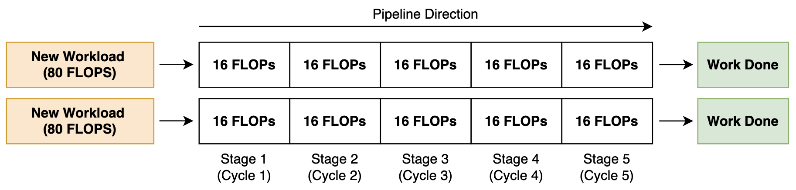
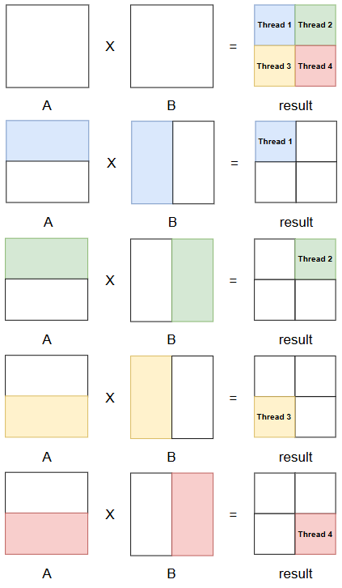

## CPU SGEMM 최적화 프로젝트
SGEMM(Single-precision General Matrix Multiplication)은 딥러닝 모델의 학습과 추론 과정에서 가장 큰 비중을 차지하는 연산입니다. 대부분의 신경망 연산은 내부적으로 행렬 곱셈으로 변환되어 처리되므로, SGEMM의 성능은 곧 전체 시스템의 처리량(Throughput)과 직결됩니다.

행렬 곱셈은 연산 밀도가 높고 메모리 접근 패턴이 규칙적이기 때문에, CPU 프로그래밍의 다양한 최적화 기법을 적용하고 그 효과를 실험하기에 가장 적합한 표준 벤치마크이기도 합니다. 

본 글에서는 기본적인 행렬곱셈 구현에서 시작하여, 하드웨어 성능을 한계치까지 끌어올리기 위해 다음과 같은 단계별 최적화 기법들을 적용하고 NumPy (Intel MKL기반 BLAS)와의 성능 비교를 수행하였습니다.

1. Compiler Optimization Flags: 컴파일러의 최적화 플래그(-O3, -march=native, -ffast-math)를 사용하여 코드 수준에서 성능을 향상
2. Register Accumulation: 반복문 내에서 레지스터를 활용하여 중간 결과를 저장함으로써 메모리 접근을 줄이는 기법
3. Loop Order Optimization (Cache-aware): 행렬 곱셈의 세 중첩 루프의 순서를 변경하여 캐시 효율성을 개선
4. Tiling 1D: 행렬을 작은 블록으로 나누어 처리하여 캐시 효율을 높이는 기법
5. Tiling 2D: 추가 예정
6. Row-Column Parallel Tiling: 행렬을 타일로 나누고, 각 타일에 대해 행과 열을 병렬로 처리하여 멀티코어 CPU의 성능 최적화

## 최적화 성능 비교
#### Hardware Info
- CPU: Intel(R) Core(TM) i7-7700HQ CPU @ 2.80GHz (실제 계산중에는 대략 3.6GHz로 동작)
    - 다음 명령어를 통해 벤치마크 중 CPU 클럭 속도 모니터링 가능
    - ```watch -n 0.1 grep \"cpu MHz\" /proc/cpuinfo```
- 4 physical cores (8 logical cores)
- L1d Cache: 128 KiB (32KiB per Core)
- L2 Cache: 1 MiB (256KiB per Core)
- L3 Cache: 6 MiB (Shared)

| 최적화 기법 적용 | Latency (s) | Relative Performance |
|------------------------|-------------|---------|
| Baseline (BLAS)        | 0.0072      |         |
| Naive (No Optimzation) | 3.9964      | 0.18%  |
| Naive + Compiler Flags (-O3, -march=native, -ffast-math) | 1.667  | 0.43%  |
| Register Accumulation   | 1.5296      | 0.47%  |
| Loop Order Optimization | 0.0804      | 9.0%  |
| Tiling (1D)            | 0.0623      | 11.5%  |
| Row-Column Parallel Tiling (1D) | 0.0197      | 36.5%  |

## Total FLOPs 계산

NumPy는 4-core Intel CPU에서 1024x1024 행렬 곱셈을 약 7.2ms만에 수행할 수 있습니다. 이는 대략적으로 한 Cycle에 Core 당 18 FLOPs를 달성하는 수준입니다.

먼저 어떻게 이러한 FLOPs 수치를 계산하는지 살펴보겠습니다. SGEMM의 총 FLOPs는 다음과 같이 계산됩니다.

```py
def Matmul(A, B):
    M = A.shape[0]
    K = A.shape[1]
    N = B.shape[1]
    C = np.zeros((M, N), dtype=np.float32)
    for row in range(M):
        for col in range(N):
            # 각 row와 col에 대해 K번의 곱셈과 K-1번의 덧셈이 필요
            for inner in range(K):
                C[row, col] += A[row, inner] * B[inner, col]          
```

위 코드에서 각 요소 C[row, col]을 계산하기 위해 K번의 곱셈과 K-1번의 덧셈이 필요합니다. 따라서 총 FLOPs는 다음과 같이 계산됩니다. 계산 편의를 위해 덧셈도 K번의 연산으로 간주하여 2K로 표현할 수 있습니다.

$$
\text{Total FLOPs} = M \times N \times (K \times 2)
$$

만약 M = N = K = 1024인 경우, 총 FLOPs는 다음과 같이 계산됩니다.

$$
\text{Total FLOPs} = 1024 \times 1024 \times (1024 \times 2) = 2 \cdot 10^{9} \text{ FLOPs}
$$

이제 이 FLOPs 수치를 바탕으로 성능을 계산할 수 있습니다. 총 4개의 CPU 코어가 7.2ms에 2 GFLOPs를 처리할 수 있다면, 각 코어가 처리하는 FLOPs는 다음과 같습니다.

$$
\text{FLOPs per Core} = \frac{2 \cdot 10^{9} \text{ FLOPs}}{4 \text{ cores}} \approx 5 \cdot 10^{8} \text{ FLOPs per Core}
$$

각 코어는 7.2ms에 $5 \cdot 10^{8}$ FLOPs만큼 처리할 수 있고 7.2ms는 대략적으로 $26 \cdot 10^{6}$ CPU cycles에 해당합니다 (CPU 클럭 속도가 3.6 GHz인 경우).

$$
\text{Cycles per Core} = 3.6 \text{ GHz} \times 0.0072 \text{ seconds} \approx 26 \cdot 10^{6} \text{ cycles}
$$

따라서 각 코어가 달성하는 FLOPs per Cycle은 다음과 같이 계산됩니다. 

$$
\text{FLOPs per Cycle per Core} = \frac{5 \cdot 10^{8} \text{ FLOPs per Core}}{26 \cdot 10^{6} \text{ cycles}} \approx 19.23 \text{ FLOPs per Cycle per Core}
$$

## 필요 메모리 계산
SGEMM에서 메모리 대역폭도 중요한 성능 요소입니다. 각 1024x1024 행렬은 4MB의 메모리를 차지합니다 (1024 x 1024 x 4 bytes). 세 개의 행렬 A, B, C를 모두 고려하면 총 12MB의 메모리가 필요합니다.

현재 1024 x 1024 행렬 곱셈에서는 메모리 접근에 필요한 지연시간은 약 1~2ms 정도로 측정됩니다 (```mbw 12``` 명령어를 통해 측정 가능). 이는 행렬 곱셈에 필요한 총 지연시간에서 작은 부분만 차지하므로 우리가 대상으로하는 행렬 곱셉 연산은 이론적으로 compute-bound 연산이라고 할 수 있습니다. 

## 어떻게 Single Core에서 19 FLOPs per Cycle이 가능한가?
이러한 높은 FLOPs per Cycle 수치는 vectorized FMA와 높은 Instruction-Level Parallelism(ILP) 덕분에 달성됩니다. 현대 CPU는 AVX2와 같은 SIMD 명령어 세트를 지원하여 한 명령어(e.g. Fused Multiply-Add, FMA)를 통해 여러 개의 요소에 대해 동시에 곱셈과 덧셈을 수행할 수 있습니다. 

예를 들어, AVX2는 256비트 레지스터(YMM)를 사용하여 8개의 Single-precision (float32) 요소를 한 번에 처리할 수 있습니다. FMA 명령어는 하나의 명령어로 곱셈과 덧셈을 결합하여 2 FLOPs를 수행하므로, 이론적으로 한 명령어당 16 FLOPs(```8 elements x 2 FLOPs per element```)를 달성할 수 있습니다.

인텔의 7세대 Kaby Lake를 기준으로 Core 당 FMA 하드웨어 유닛은 2개가 존재(2-way superscalar)하므로, 이론적으로 동시에 두개의 FMA 명령어 실행을 통해 최대 32 FLOPs를 달성할 수 있습니다.

각 FMA 하드웨어 유닛은 5개의 Pipeline Stage를 가지고 있으며 한 명령어가 완전히 실행되기까지 5 사이클이 걸립니다. 매 사이클마다 2개의 FMA 명령어가 발행되고, 각 명령어가 16 FLOPs를 수행하므로, 이론적으로 최대 32 FLOPs per Cycle per Core를 달성할 수 있습니다. 이러한 파이프라인을 쉬지 않고 채워 ILP를 최대화하기 위해서는 매 사이클마다 16 * 10 = 160 FLOPs 만큼의 workload가 준비 되어야함을 의미합니다. 다음은 FMA 유닛의 파이프라인을 시각화한 것입니다.



## Naive Implementation
다음 코드는 최적화되지않은 행렬 곱셈 구현입니다. 
```cpp
template <int M, int N, int K>
inline void MatmulImplNaive(const float* A, const float* B, float* result) {
  for (int m = 0; m < M; m++) { // row loop M
    for (int n = 0; n < N; n++) { // column loop N
      for (int k = 0; k < K; k++) { // inner loop K
        result[m * N + n] += A[m * K + k] * B[k * N + n];
      }
    }
  }
}
```
각 요소 result[m, n]을 계산하기 위해 입력 행렬 A와 B을 K번 접근합니다. 이를 시각화하면 다음과 같습니다.


현재 사용하는 CPU에서는 한번의 메모리 접근이 64B cacheline 단위로 이루어집니다. 다시 말해 한번의 float32 (4B) 접근이 16개의 요소를 포함하는 cacheline을 불러옵니다. 여기서 cacheline은 메모리에 row-continous하게 저장된 요소들의 집합입니다.

다시 Naive 행렬 곱셈 구현으로으로 돌아가서, 메모리 접근 패턴을 보면 입력 행렬 A에 대해서는 row-continous하게 접근하는 반면, 입력 행렬 B에 대해서는 column-continous하게 접근하는 것을 알 수 있습니다.

이는 입력 행렬 B에 대한 메모리 접근이 L1d 캐시가 32KB로 제한된 상황에서는 매번 새로운 cacheline을 불러와야 하는 cache miss를 유발하여 성능 저하의 주요 원인이 됩니다. 행렬 B를 위해 row-continous하게 로드된 cacheline은 단 하나의 요소만 사용되고 나머지 15개 요소는 활용되지 않는 낭비가 발생합니다.

Naive 구현은 약 4초의 latency를 보이며, 이는 NumPy의 7.2ms에 비해 약 555배 느린 성능입니다.

## Naive + Compiler Optimization Flags
컴파일러 최적화 플래그를 적용하여 Naive 구현의 성능을향상시킬 수 있습니다. 다음과 같은 플래그를 사용하였습니다.
- ```-O3```: 고급 최적화 레벨로, 루프 변환, 인라인 확장, 벡터화 등 다양한 최적화 기법을 적용
- ```-march=native```: 현재 시스템의 CPU 아키텍처에 최적화된 코드 생성을 허용하여 AVX2와 같은 SIMD 명령어 세트를 활용 (Non-portable)
- ```-ffast-math```: 수학 연산에 대한 엄격한 표준을 완화하여 더 공격적인 최적화를 가능하게 함 (예: 부동 소수점 연산의 재배열, NaN과 Inf에 대한 특별 처리 생략)

컴파일러 최적화 플래그를 적용한 Naive 구현은 약 1.667초의 latency를 보이며, 이는 NumPy의 7.2ms에 비해 약 220배 느린 성능입니다. 컴파일러 최적화 플래그를 적용함으로써 Naive 구현의 성능이 약 2.4배 향상되었음을 알 수 있습니다.

이후 소개되는 최적화 기법들은 모두 컴파일러 최적화 플래그가 적용이 되어 있는 Naive 구현을 기반으로 성능 향상을 도모합니다.

## Register Accumulation
Register Accumulation 기법을 적용하여 Naive 구현의 성능을 더욱 향상시킬 수 있습니다. 이 기법은 반복문 내에서 레지스터를 활용하여 중간 결과를 저장함으로써 메모리 접근을 줄이는 방법입니다. 다음은 Register Accumulation이 적용된 행렬 곱셈 구현입니다.

```cpp
template <int M, int N, int K>
inline void MatmulImplNaiveRegisterAcc(const float* A, const float* B,
                                       float* result) {
  for (int m = 0; m < M; m++) { // row loop M
    for (int n = 0; n < N; n++) { // column loop N
      // result[m * N + n]에 대한 누적 합을 저장할 레지스터 변수   
      float acc = 0.0;
      for (int k = 0; k < K; k++) { // inner loop K
        acc += A[m * K + k] * B[k * N + n];
      }
      // 계산된 누적 합을 메모리에 저장
      result[m * N + n] = acc;
    }
  }
}
```

Register Accumulation 기법을 적용한 Naive 구현은 약 1.53초의 latency를 보이며, 이는 NumPy의 7.2ms에 비해 약 213배 느린 성능입니다. Register Accumulation 기법을 적용함으로써 Naive 구현의 성능이 약 1.27배 향상되었음을 알 수 있습니다. 이러한 개선은 잦은 L1d 캐시 접근 (result 접근을 위해) 대신 레지스터를 활용하여 중간 결과를 저장함으로써 메모리 접근 횟수를 줄인 덕분입니다.

## Cache-aware Loop Order Optimization
Naive 구현에서 메모리 접근 패턴이 입력 행렬 B에 대해 column-continous하게 접근하는 것이 주요 성능 저하의 원인임을 알 수 있었습니다. 이를 개선하기 위해 행렬 곱셈의 세 중첩 루프의 순서를 변경하여 캐시 효율성을 개선할 수 있습니다. 다음은 Loop Order Optimization이 적용된 행렬 곱셈 구현입니다.

```cpp
template <int M, int N, int K>
inline void MatmulImplLoopOrder(const float* A, const float* B, float* result) {
  for (int m = 0; m < M; m++) { // row loop M
    // Naive 구현에서 2번째와 3번째 루프의 순서를 변경하여 B에 대한 row-continous 접근을 가능하게 함
    for (int k = 0; k < K; k++) { // inner loop K
      for (int n = 0; n < N; n++) { // column loop N
        result[m * N + n] += A[m * K + k] * B[k * N + n];
      }
    }
  }
}
```

이는 입력 행렬 B을 접근하기 위해 로드된 cacheline을 효과적으로 활용(cacheline의 16개의 데이터 모두 사용)할 수 있게 하여 L1d 캐시의 효율성을 크게 개선합니다. Loop Order Optimization이 적용된 구현은 약 0.0804초의 latency를 보이며, 이는 NumPy의 7.2ms에 비해 약 11배 느린 성능입니다. Loop Order Optimization 기법을 적용함으로써 **Naive 구현 대비 약 21배 향상**되었음을 알 수 있습니다.

## 1D Tiling
"Loop Order Optimization을 통해 입력 행렬 B에 대한 캐시 효율성을 개선할 수 있었습니다. 하지만 입력 행렬 B의 각 row는 4KB이므로, L1d 캐시가 32KB로 제한된 상황에서는 B 행렬의 약 4개의 row만이 L1d 캐시에 유지될 수 있습니다. 따라서 row loop M이 진행됨에 따라 재사용이 가능한 B의 cacheline이 용량 한계로 인해 L1d 캐시에서 Evict되어 다시 로드해야 하는 상황이 발생합니다. 이를 해결하기 위해 inner loop K를 타일링하여 B의 cacheline이 L1d 캐시에 유지되는 동안 최대한 활용할 수 있도록 개선했습니다."

```cpp
template <int M, int N, int K, int TileSize>
inline void MatmulImplTiling1D(const float* A, const float* B, float* result) {
  for (int tile_offset = 0; tile_offset < K; tile_offset += TileSize) {
    for (int m = 0; m < M; ++m) {
      for (int k = tile_offset; k < std::min(K, tile_offset + TileSize); ++k) {
        for (int n = 0; n < N; ++n) {
          result[m * N + n] += A[m * K + k] * B[k * N + n];
        }
      }
    }
  }
}
```

**이론상으로는 TileSize를 4로 설정하는 것이 L1d 캐시의 효율성을 최대화하는 최적의 타일 크기가 됩니다. 하지만 현실에서는 L1d 캐시의 용량을 넘어서는 TileSize인 16과 32에서 더 좋은 성능을 보였습니다.**

#### 타일 크기에 따른 성능 비교
| TileSize | Latency (s) |
|----------|-------------|
| 4        | 0.0798      |
| 8        | 0.0732      |
| 16       | 0.0668      |
| **32**       | **0.0623**      |
| 64       | 0.0637      |

이는 복잡한 Loop overhead 비용과 Hardware prefetcher의 효과(사용 가능성이 높은 데이터를 미리 L1/L2 캐시에 로드)로 인해 실제 최적의 타일 크기가 이론적인 계산과 다를 수 있음을 보여줍니다. 실제 현업에는 다양한 시도를 통한 경험적 최적화가 중요하다고 합니다. 

## 2D Tiling (TODO)

## Row-Column Parallel Tiling
지금까지는 단일 코어에서의 최적화에 초점을 맞추어 왔습니다. 하지만 현대 CPU는 멀티코어 아키텍처를 가지고 있기 때문에, 행렬 곱셈을 병렬로 처리하여 성능을 더욱 향상시킬 수 있습니다.

기본적인 아이디어는 결과 행렬 C를 Thread 개수 만큼의 타일로 나누고, 각 타일을 별도의 Thread에서 병렬로 계산하는 것입니다. 이때 Thread들이 담당하는 구역이 겹치면 atomic이나 locking이 수반되는 partial reduction 필요해지므로, 각 Thread가 완전히 독립된 구역을 계산하도록 타일링 전략을 설계하는 것이 중요합니다. 다음은 Row-Column Parallel Tiling이 적용된 행렬 곱셈 구현입니다. 

```cpp
template <int M, int N, int K, int TileSize>
inline void MatmulImplRowColParallelTiling1D(const float* A, const float* B,
                                             float* result) {
#pragma omp parallel for shared(result, A, B) default(none) collapse(2) \
    num_threads(8)

  for (int row_tile = 0; row_tile < M; row_tile += 256) {
    for (int col_tile = 0; col_tile < N; col_tile += 256) {
      for (int inner_tile = 0; inner_tile < K; inner_tile += TileSize) {
        for (int m = row_tile; m < row_tile + 256; ++m) {
          int inner_tile_end = std::min(K, inner_tile + TileSize);
          for (int k = inner_tile; k < inner_tile_end; ++k) {
            for (int n = col_tile; n < col_tile + 256; ++n) {
              result[m * N + n] += A[m * K + k] * B[k * N + n];
            }
          }
        }
      }
    }
  }
}
```

위 코드를 Thread가 4개라고 가정했을 때의 상황을 시각화하면 다음과 같습니다. 결과 행렬 C를 4개의 타일로 나누고, 각 독립된 타일의 결과를 별도의 Thread에서 병렬로 계산하도록 설계되어 있습니다. 각 Thread는 자신이 담당하는 타일에 대해서만 계산을 수행하므로, atomic이나 locking이 필요한 partial reduction이 발생하지 않습니다.


성능측정 결과 Row-Column Parallel Tiling이 적용된 구현은 약 19.7ms latency를 보이며, 이는 NumPy의 7.2ms에 비해 약 2.7배 느린 성능입니다. Row-Column Parallel Tiling 기법을 적용함으로써 Naive 구현 대비 약 85배 향상되었음을 알 수 있습니다. 

## References
[1] https://siboehm.com/articles/22/Fast-MMM-on-CPU 